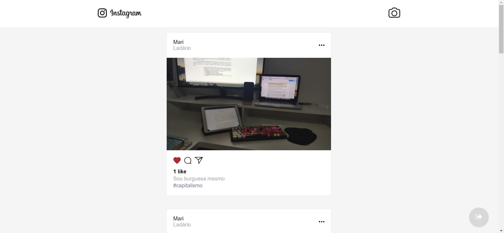
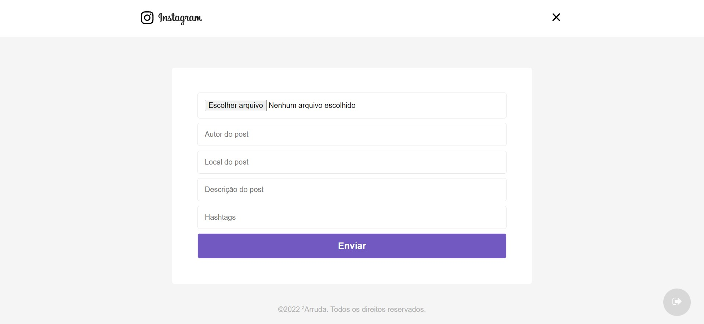

<h1 align="center">
    <a href="https://andrearruda-omnistack7.vercel.app/login" target="_blank">
        
    </a>
</h1>

<h4 align="center">
    Instarocket
</h4>


<p align="center">
  <a href="#-tecnologias">Tecnologias</a>&nbsp;&nbsp;&nbsp;|&nbsp;&nbsp;&nbsp;
  <a href="#-projeto">Projeto</a>&nbsp;&nbsp;&nbsp;|&nbsp;&nbsp;&nbsp;
  <a href="#instalação">Instalação</a>&nbsp;&nbsp;&nbsp;|&nbsp;&nbsp;&nbsp;
  <a href="#telas">Telas</a>&nbsp;&nbsp;&nbsp;|&nbsp;&nbsp;&nbsp;
  <a href="#exemplo">Exemplo</a>
</p>


## 🚀 Tecnologias

Esse projeto foi desenvolvido com as seguintes tecnologias:
- [Django](https://www.djangoproject.com/)
- [Django-Rest-Framework](https://www.django-rest-framework.org/)
- [React](https://reactjs.org)


## 💻 Projeto
**Este é um clone do Instagram feito na semana OMNISTACK 7 da Rocketseat. Nele é possível postar uma foto e dar likes.**

## Instalação
### Pré requisitos
Ter instalado:
- [Python](https://www.python.org/downloads/)
- [Node](https://nodejs.org/en/download/)
- [Yarn](https://classic.yarnpkg.com/en/docs/install/)


## BACKEND
```sh
# Clonar repositório
git clone https://github.com/andre23arruda/instarocket.git

# Entrar na pasta dos arquivos do backend
cd backend

# Renomear env_example.py para env.py
cp setup/env_example.py setup/env.py

# Criar um ambiente virtual
python -m venv venv

# Ativar o ambiente virtual
. activate.sh
# ou . venv/Scripts/activate
# ou ./venv/bin/activate

# Instalar os pacotes necessários
pip install -r requirements.txt

# Executar as migrações
python manage.py migrate

# Run
. run.sh
```


### Frontend
#### No terminal, rodar
```sh
# Entrar na pasta dos arquivos do frontend
cd frontend

# Renomear .env_example para .env
cp .env_example .env

# Instalar os pacotes necessários
yarn install

# Rodar
yarn start
```


## Telas
<div align="center">
    
</div>
<p align="center">Login</p>
<hr>

<div align="center">
    
</div>
<p align="center">Feed</p>
<hr>

<div align="center">
    
</div>
<p align="center">New Post</p>


## Exemplo
<a href="https://andrearruda-omnistack7.vercel.app/login" target="_blank">Visitar</a>
